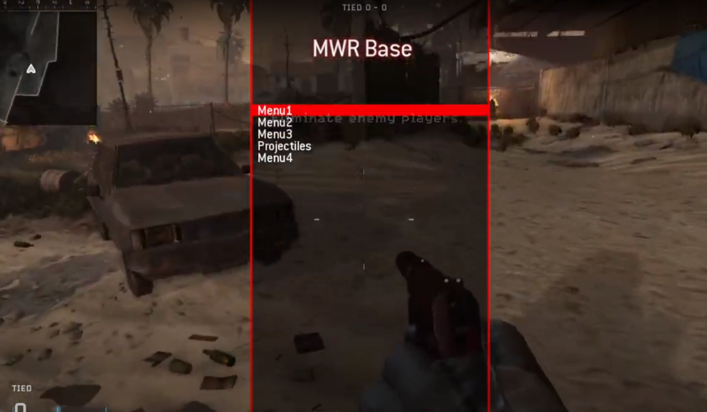

# MWRBase (Modern Warfare Remastered)

HudElem all client menu base, Has gsc examples for MagicBullet, GetEye, iPrintln, iclientprintln
Everyone get access to the menu, if want only some people to have it need to make a auth system

Current Controls:
	Open/Back/Close: Knife
	Scroll Up: Shoot
	Scroll Down: ADS
	Select: Jump

### Usage
1. Gonna need [Microsoft Detours](https://github.com/microsoft/Detours)
2. I build the project with VS2022, Other versions of Visual Studio will work but will need to change 'Platform Toolset'
3. Compile with x64
4. Inject with any injector you want

# Dependencies
- [Microsoft Detours](https://github.com/microsoft/Detours)
